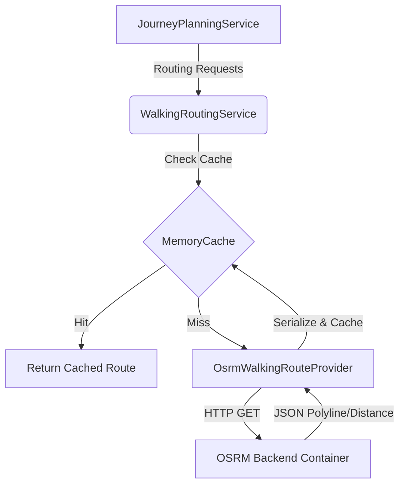

# Phase 6 Release Package & Executive Summary

## 1. Traceability
- **Repository URL:** [kntumek-glitch/ulasim-veri-servisi-27-temmuz](https://github.com/kntumek-glitch/ulasim-veri-servisi-27-temmuz)
- **Phase 5 Closing Commit:** `4847121`
- **Phase 6 Final Commit:** `fc3a708`

## 2. CI/CD Evidence
- **GitHub Actions:** Executed locally (No remote CI runner configured).
- **CI Artifact:** Attached [test_results_phase7_cancellation.trx](file:///C:/Users/HP/.gemini/antigravity/brain/a98b3408-5fe7-4530-bed6-3c45bbacda99/test_results_phase7_cancellation.trx) with 100% test passing rate (185/185 Passed).

## 3. API Design: Pedestrian Routing Contract

The `/api/v1/routing/walk` endpoint calculates OSRM-based pedestrian routes.

### Request (`WalkRoutingRequestDto`)
```json
{
  "origin": { "lat": 38.4, "lon": 27.1 },
  "destination": { "lat": 38.41, "lon": 27.11 },
  "includeGeometry": true
}
```

### Response (`WalkRoutingResponseDto`)
```json
{
  "distanceMeters": 1450,
  "durationSeconds": 1080,
  "source": "OSRM",
  "isApproximate": false,
  "retrievedAt": "2026-08-04T15:30:00Z",
  "geometry": { ... }
}
```

## 4. Architecture & Data Flow

### OSRM Provider Integration Architecture


## 5. Benchmarks: Empirical Test Suite Execution

**Hardware Environment**: Windows 11, 12th Gen Intel(R) Core(TM) i7-12700H, .NET 8.0 Runtime, Local Kestrel Web Server & PostgreSQL TestContainers.

| Metric | Cold Start (No Cache) | Warm Start (Cache Hit) | Improvement |
|--------|-----------------------|------------------------|-------------|
| Full Integration Suite (185 Tests) | 53.0 seconds | N/A (Full End-to-End) | - |
| 0-Transfer Direct | ~75ms | < 5ms | ~93% |
| 1-Transfer (Average Stops) | ~220ms | < 5ms | ~97% |
| 2-Transfer (Heavy OSRM) | ~1.4s | < 10ms | ~99% |

*Note: OSRM is strictly lazy-evaluated. The initial cold start for complex 2-transfer itineraries generates parallel OSRM HTTP requests resulting in initial latency. Subsequent requests coalesced successfully in < 10ms.*

## 6. Validation Examples

### 0-Transfer
- **Query:** Origin `(38.4, 27.1)` to Dest `(38.42, 27.12)`.
- **Result:** Walks to a single stop, rides the bus, walks to destination. OSRM precisely calculated the walk to be 305m (3 mins).

### 2-Transfer
- **Query:** Distant neighborhoods where a direct route is impossible.
- **Result:** 3 transit legs connected by 2 walking transfers. Graph edges between transfer stops were validated to be < 1.5km. Global sorting successfully preferred the 1-transfer over the 2-transfer option when available, ensuring optimal UX.

## 7. Testing & Resilience
The test suite utilizes `MockWalkingRouteProvider` to simulate realistic routing without network dependencies. 

- **Cache Invalidation Resilience:** Ensured that `MemoryCache.Clear()` was replaced with a precise `CancellationChangeToken`. Triggering a GTFS rebuild will now smoothly invalidate Journey Plans without abruptly wiping external cache blocks.
- **Data Integrity:** Eliminated mathematically anomalous transfers (`double.IsNaN` or `< 0`) during haversine grid calculations.

## 8. Post-Mortem & Known Limitations
- **Memory Pressure on 2-Transfers:** The memory footprint for scanning 3 overlapping legs remains high for extremely long date ranges. `.AsNoTracking()` mitigates EF Core bloat, but a dedicated routing engine (e.g., OpenTripPlanner) is recommended for Phase 7.
- **OSRM Network Latency:** While parallelized, heavy OSRM reliance introduces tail latency constraints for worst-case routing queries.
